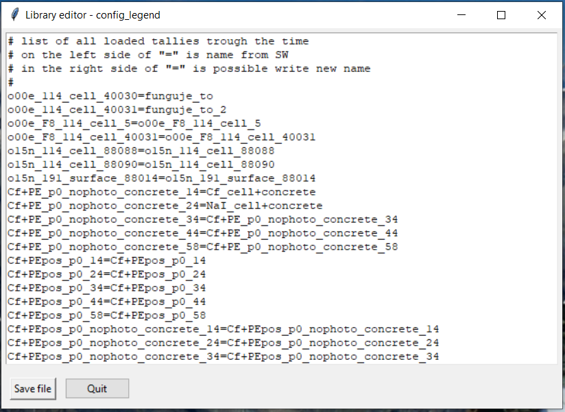

# MCNP 2D tally plotter

## TODO:
- improve description how to build a conda environment from enviroment.yml file (included)
<!--
https://www.freecodecamp.org/news/how-to-write-a-good-readme-file/
-->

## Short description of MCNP Plotter

* this plotter was created to simplify 2D tally data extraction from MCNP output files and their visualisation
* despite different codes, this one has a Graphical User Interface and allows doing some basic plot modifications
* tested **ONLY** with certain MCNPX, 6.1 and 6.2 tally type, does **NOT** support **mctal**, **mdata**, **meshtal** and **runtpe** files.
* [MCNP Tools package](https://github.com/lanl/mcnptools) for more advanced tally loading will be included in the near future. 
* a full description is in sections below
* installation will be described in the Readme.md file at GitHub/GitLab (tested on macOS and Windows10)
  - plotter can be run uncompiled with all necessary packages. The best option is to install a Conda environment from .YML file at GitHub/GitLab
  - the second option involves using a compiled code. The Python compiler > 3.8 is required.
* possibility to show XS data together with tally data (all XS were downloaded from IAEA ENDF [webpage](https://www-nds.iaea.org/exfor/endf.htm))

## Main window

- this window is shown immediately after the program start
- list of options:
  - **Choose directory** - will open a dialog for work directory selection. Program read all `output` files in thi directory and ignore all non MCNP files
  - **Update directory** - this option read again content of work directory.
  - **Plot data** - all selected tallies are plotted in a new window.
  - **Export tally to xlsx** - all selected tally are saved to `.xsls` file. User has to choose the `.xsls` file name in the saving dialog. Every tally is saved to a separate list.
  - **check all** - this check box allows us to check/uncheck all tallies.

- after the data are loaded from the working folder, its parameters are displayed:
  - the first column is check box for data selection
  - **File** - is a unique identifier created from output file name and tally number
  - **Tally number** - tally number from output file
  - **Tally type** - shows a tally type from output file
  - **Particle** - tally particle
  - **Number of values** - number of values in the tally
  - **E_cut-off (MeV)** - energy cut off is taken from the output cut off table if was printed or default value is used (default values are taken from the MCNP manual). Cut off energy is put before first energy in the tally results.
  - **E_min (MeV)** - lowest energy from the tally
  - **E_max (MeV)** - highest energy from the tally
  - **comment** - tally comment if was defined by user

## Plot window
- the plot window could be divided into several parts:
  1. figure section - shows data selected in the main window and edited by section 2. and 3.
  2. plotter settings - this section allows some basic changes. A more detailed description is below.
  3. figure tools - allows manual zoom by magnifier tool, move in changes back and forward, modify position of titles and plot, move curves in the figure and save plot into several formats.

### Plot settings and replot
- most of the changes are applied immediately after a widget is used.
- this behavior could be deactivated by check box in the lower part of this section. After that must be used button **Replot** to apply all settings.
- A Quit button could be used for a return to the main window. 

A short description of major settings:
* X and Y axis settings allows changing a scale between linear and logarithmic
* Data input switch between normalized (data are divided by energy bins, then values are normalized per one MeV) and unnormalized data (default).
* show/hide error bars checkbox is useful in a case of worse statistics when a figure is saturated by error bars.
* menu button in Data input frame allows choosing a tally for ratio plot. All other tallies are divided by the selected tally. This works only if all tallies in the plot have the same bins.
* Legend setting - allows change legend position and font size
* Font size frame - allows change Axes title and Ticks font size
* Grid settings frame - allows to turn on/off a grid with different settings
* A Cross-section frame allows showing XS data in the picture with a secondary Y axis.
* Export frame - is used for applying several other settings described in the next subsection.
    - Editor settings/legend open an Editor for `config_export` or `config_legend` file
    - On/Off save figure activate figure saving after every replot
    - On/Off LaTeX - this checkbox is now deprecated, but in the future will allow use LaTeX fonts and formatting (only with LaTeX compiler, e.g. MikTeX, LiveTex)
    - On/Off X/Y/Y2 axis limits are using limit values from a `config` file
    - Update export - read again setting from the  `config` file

### Config files editor
- Editor settings/legend from Export frame open a new window depending on a menu button above this button
- there are two options:
  - config_export - this file content wide option for figure editing. It includes axis title names and min/max values, figure export parameters (dpi, file extension), etc. Default value for all variables is `None`  
  - config_legend - in this file are stored all tallies during the read process if they are not already here. Users can change the file name used in the figure legend by editing string behind equal symbol.   

### Source of XS data

- in the current state is supported only a specific format of XS data from the IAEA ENDF [webpage](https://www-nds.iaea.org/exfor/endf.htm)
- in this database are available, all main evaluated databases and their older versions
- the user has to select and plot all required data. In the plotter page is possible to download all plotted data (red circle in the picture below)

- the MCNP plotter can show data only from one file. Therefore, all XS values must be in one file.
- as a control sequence is used `#` symbol. Only data where is `#` removed from name string will be plotted.
- a string following name is used as a name in figure legend.

