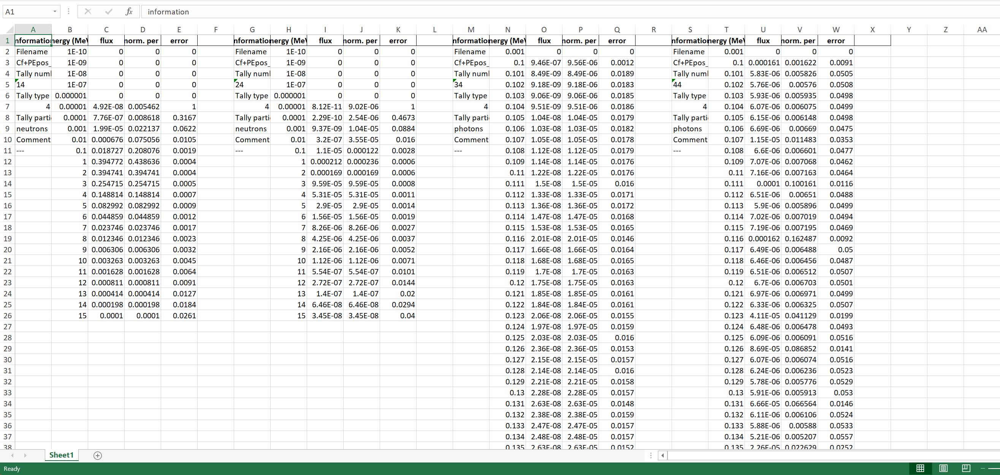
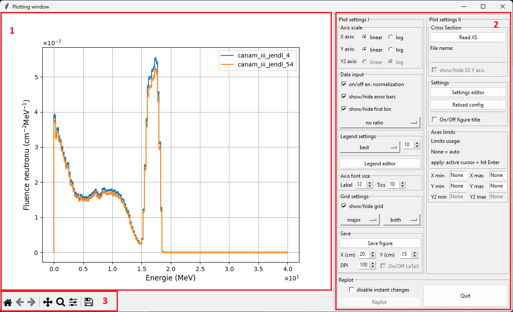

# MCNP 2D tally plotter

<!--
## TODO:
https://www.freecodecamp.org/news/how-to-write-a-good-readme-file/
-->

## How to run plotter
Two main options:
1. Download EXE files from last release (usually available for Linux and Windows x64)
2. Download source files + install python with required libraries

### Executable files
This option offers the most simple use of the MCNP tally plotter. User needs to download and install basic Python 3.8 or newer (works with different versions but this one is tested). Current files are available in Releases at the main page.

### Source files

Users can run uncompiled code with necessary packages:
- Python >=3.8
- ttkwidgets
- openpyxl (release v0.8 and older) - pandas dependecy
- pandas (release v0.8.1 and newer)
- matplotlib <3.8 (removed API for getting color cycle out of an Axes)
- pywin32 (Windows only)

Virtual environment is prefered option how to install necessary libraries (Conda, virtualenv, etc.). Program has to be started by running following command:

<!--- To recreate the Conda environment, for this project, run the following command:

```
conda env create --file environment_file.yml
```

This will create a new environment named `plotter_env` or similar. The dependencies and versions should be same as ones used in this project.

The `plotter_env` can be activated trough **Anaconda Prompt** or with **Anaconda Navigator**. Users can run software by using this command in the activated environment:
-->

```
python mcnp_tally_plot_main.py
```

## Short description of MCNP Plotter

* this plotter was created for quick and efficient visualization of 2D tally data extracted from MCNP output files,
* despite different codes, this one has a Graphical User Interface and allows doing some basic plot modifications,
* tested with some simple tally results from MCNPX, 6.1, 6.2 and 6.3, does **NOT** support  **mctal** (planned), **mdata**, **meshtal** and **runtpe** files,
* [MCNP Tools package](https://github.com/lanl/mcnptools) for more advanced tally loading will be included in the near future (**mctal** support),
* you can find a full description in the sections below,
* simple XS data might be shown together with tally data (all XS were obtained from IAEA ENDF [webpage](https://www-nds.iaea.org/exfor/endf.htm)) - this is a temporary solution, in the future, there will be a possibility to use show XS data from MCNP ACE files.

## More detailed description - Main window

- this window is shown immediately after the program start
- list of options:
  - **Choose directory** - will open a dialog for work directory selection. Program read all `output` files in thi directory and ignore all non MCNP files
  - **Update directory** - this option read again content of work directory.
  - **Plot data** - all selected tallies are plotted in a new window.
  - **Export tally to xlsx** - all selected tally are saved to `.xsls` file. User has to choose the `.xsls` file name in the saving dialog. All tally are saved into single sheet.
  - **(un)check all** - this function is activated by left mouse button by clicking on column name (un)check all. It checks or unchecks all tallies in the list.
  - **sort by column** - this function is activated by left mouse button by clicking on column name. It sorts all tallies by the selected column.

<figure>
  
  <figcaption>Main window without data</figcaption>
</figure>

- the table in the main window contains several columns which are shown after the first output file is read:
  - the first column is check box for data selection
  - **File** - is a unique identifier created from output file name and tally number
  - **Tally number** - tally number from output file
  - **Tally type** - shows a tally type from output file
  - **Particle** - tally particle
  - **Number of values** - number of values in the tally
  - **E_cut-off (MeV)** - energy cut off is taken from the output cut off table if was printed or default value is used (default values are taken from the MCNP manual). Cut off energy is put before first energy in the tally results.
  - **E_min (MeV)** - lowest energy from the tally
  - **E_max (MeV)** - highest energy from the tally
  - **comment** - tally comment if was defined by user

### Main window with available tallies:

<figure>
  
  <figcaption>Main window with data</figcaption>
</figure>

<figure>
  
  <figcaption>Example of .xlsx file export</figcaption>
</figure>

## More detailed description - Plot window
- the main parts of the plot window:
  1. figure section - shows data selected in the main window and edited by section 2. and 3.
  2. plotter settings - this section allows some basic changes. A more detailed description is below.
  3. figure tools - allows manual zoom by magnifier tool, move in changes back and forward, modify position of titles and plot, move curves in the figure and save plot into several formats.

<figure>
  
  <figcaption>Plotter window only with tally data</figcaption>
</figure>

### Plot settings and replot
- most of the plot settings are applied instantly.
- this behavior could be deactivated by check box in bottom part of the window (Replot frame). Then, all changes are applied with button **Replot**.
- A Quit button could be used for a return to the main window. 

**A brief description of major settings:**
* some settings are not available after the **Plotting window** is opened. The activation depends on availability of appropriate dataset(s).
* **Axis scale** frame allows to change axes scale between linear and logarithmic options
* **Data input** frame offers several optins
  * data normalization per 1 MeV (data are divided by energy bins). Default data are normalized.
  * show/hide error bars might be useful in a case of worse statistics when a figure is saturated by error bars.
  * show/hide first bin might be useful to hide value between cut-off energy and first tally bin (if the first tally energy bin does not start with the zero/cut-off value then the MCNP is capturing values in this energy range).
  * a menu button in Data input frame allows choosing a tally for ratio plot. All other tallies are divided by the selected tally. This works only if all tallies in the plot have the same bins.
* **Legend setting** frame - allows change legend position and font size.
  * Legend editor button opens a new window with text editor for a `config_legend` file modifications. User can change datasets labels in the plot legend.
* **Font size** frame - allows change Axes labels and Ticks font size.
* **Grid settings** frame - allows to turn on/off a grid with different settings.
* **Save** frame allows store a figure with specific dimensions and DPI. LaTeX option is **not** available right now.
* **Cross-section** (XS) frame allows showing XS data in the picture with a secondary Y axis. Options connected to XS are activated when user uploads XS data
* **Settings** frame - allows open and modify `config_export` file. This file stores all current options chosen by user in GUI window and some options which are availabel only through configuration file. Functions available in config file (this might change in time):
  * a text of axes labels
  * text used in the figure title (has to be activated by user - default off)
  * Reload config button - read again setting from the  `config` file (in case users made changes in an external text editor)
* **Axes limits** allows to change minimum and maximum values of all axes.
  * `None` value is used if user wants let the plotter chose these values automatically. Changes might be applied by hitting `Enter` key when the cursor is active in an entry box.

<figure>
  
  <figcaption>Plotter window with tally result and XS data</figcaption>
</figure>


### Config files editor
- Editor settings/legend from Export frame opens a new window depending on a menu button above this button
- there are two options:
  - config_export - this file content wide option for figure editing. It includes axis title names and min/max values, figure export parameters (dpi, file extension), etc. Default value for all variables is `None`  
  - config_legend - in this file are stored all tallies during the read process if they are not already here. Users can change the file name used in the figure legend by editing string behind equal symbol.

### config export window:


### legend export window:


- the graph is reploted automatically when the user saves the config file and closes the editor window

### Source of XS data

- in the current state is supported only a specific format of XS data from the IAEA ENDF [webpage](https://www-nds.iaea.org/exfor/endf.htm)
- in this database are available, all main evaluated databases and their older versions
- the user has to select and plot all required data. In the plotter page is possible to download all plotted data (red circle in the picture below)


- the MCNP plotter can show data only from one file. Therefore, all XS values must be in one file.
- as a control sequence is used `#` symbol. Only data where is `#` removed from name string will be plotted.
- a string following a tally name is used as a name in figure legend.


